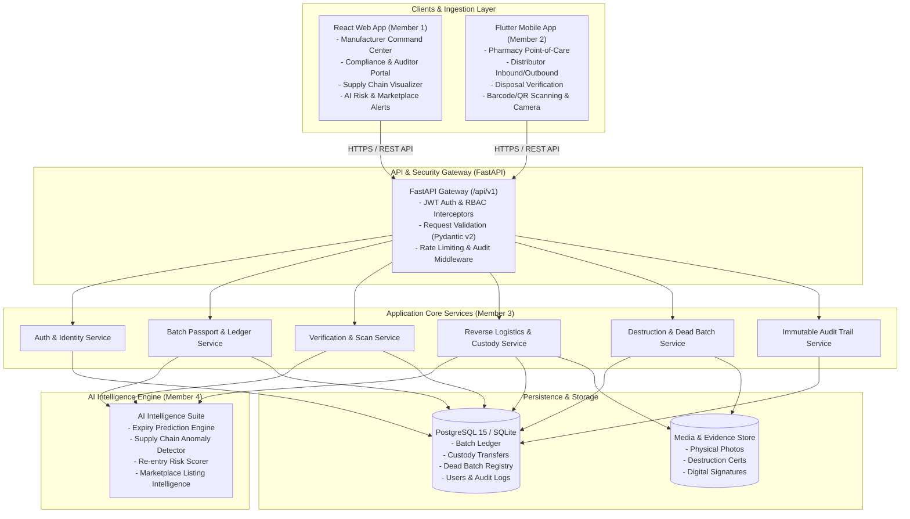

# System Architecture & Technical Specification
## PharmaSafe Intelligence Platform

---

## 1. Executive Summary & Core Mission

The pharmaceutical industry suffers billions in losses, patient casualties, and reputational damage due to counterfeit medicines, illegally diverted supplies, and unauthorized re-entry of expired or recalled batches.

Traditional track-and-trace solutions stop at the point of sale. **PharmaSafe Intelligence** establishes a **closed-loop reverse supply chain governance system** that:
1. Tracks batches from manufacturing to pharmacy dispensing.
2. Identifies and locks expired, recalled, or suspicious batches.
3. Enforces multi-party custody handshakes during reverse logistics.
4. Certifies physical destruction with cryptographic SHA-256 hashes and dual-witness verification.
5. Inscribes destroyed batches into a **Dead Batch Registry**.
6. Continuously scans physical point-of-dispense checks and web marketplace listings to trigger immediate **Dead Batch Re-entry Alerts**.

---

## 2. Component Architecture Diagram

---

## 3. Data Flow & Closed-Loop Lifecycle

### Scenario A: Forward Logistics & Dispensing
1. **Manufacturer** creates batch with unique `batch_number`, GTIN, manufacture date, expiry date, initial quantity, and cryptographic serials.
2. Batch is transferred to **Distributor** via digital custody transfer record with geo-coordinates and custodian signatures.
3. Distributor delivers to **Pharmacy**. Pharmacy scans barcode/QR to verify authenticity and accept custody.
4. Pharmacy dispenses to patient after automated verification scan checks:
   - Batch status is `ACTIVE`
   - Expiry date > current date
   - Not present in Recall list
   - Not present in Dead Batch Registry.

### Scenario B: Expiry / Recall & Reverse Logistics
1. System automated monitor (or AI Expiry Predictor) identifies batch approaching or exceeding expiration, or Manufacturer issues a **Batch Recall**.
2. Batch status transitions to `EXPIRED` or `RECALLED`. Sales are immediately locked in the system.
3. Pharmacy initiates a **Reverse Return Request** specifying quantity and return reason.
4. Logistics carrier / Distributor accepts reverse custody, validating physical batch numbers against digital records.
5. Goods arrive at **Authorized Disposal Facility**. Facility acknowledges custody and verifies intact seals and quantities.

### Scenario C: Certified Destruction & Dead Batch Inscription
1. Authorized Disposal Facility performs certified destruction (incineration / chemical denaturation).
2. Facility officer and designated witness digitally sign the destruction record and attach destruction evidence photo/video.
3. System generates a cryptographic **Destruction Certificate** with a unique SHA-256 hash.
4. Batch is inscribed into the **Dead Batch Registry**. Status permanently transitions to `DESTROYED` / `DEAD_BATCH`.
5. Any subsequent scan of this batch number anywhere in the world triggers a **CRITICAL SEVERITY: DEAD BATCH RE-ENTRY ALERT**.

---

## 4. Technology Stack Justification

- **Backend (FastAPI + SQLAlchemy 2.0 + Pydantic v2)**: High-throughput asynchronous performance, automated OpenAPI generation, rigorous type validation, and rapid developer velocity.
- **Database (PostgreSQL 15)**: ACID transactional guarantees for batch lifecycle state machines, JSONB support for flexible AI explanations and audit events.
- **Frontend (React 18 + Vite + TypeScript + Vanilla CSS Design Tokens)**: High performance, rich aesthetic flexibility without conflicting external CSS bloat, clean modularity.
- **Mobile (Flutter 3.x + Dart)**: Single cross-platform codebase for iOS and Android, native camera and barcode scanning access, offline-capable caching.
- **AI / ML (Python + Scikit-Learn + Heuristic Anomaly Detectors)**: Modular interfaces allowing seamless swap from rule-based baseline to deep learning or LLM models without altering API contracts.
