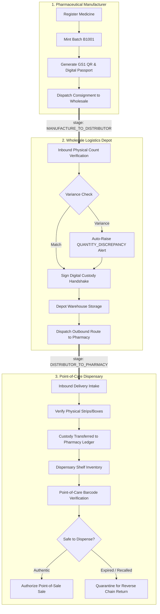

# Forward Supply Chain Cryptographic Custody Protocol

## Milestone Identity & Audit Immutability

Every forward transfer updates the single, unified Digital Batch Passport for `B1001`:

| Milestone Stage | Actor Role | Triggered By | Digital Batch Passport Output |
|---|---|---|---|
| `MANUFACTURED` | Manufacturer | Batch Registration | Genesis block created with formulation metadata and GTIN barcode |
| `MANUFACTURE_TO_DISTRIBUTOR` | Manufacturer | Depot Dispatch | Outbound manifest created with carrier details |
| `DISTRIBUTOR_RECEIVED` | Distributor | Intake Reconciliation | Physical count verified, custody transferred to wholesale depot |
| `DISTRIBUTOR_TO_PHARMACY` | Distributor | Pharmacy Dispatch | Depot stock decremented, downstream consignment transit logged |
| `PHARMACY_RECEIVED` | Pharmacy | Physical Intake | Consignment verified by pharmacist, stock placed on dispensary shelf |
